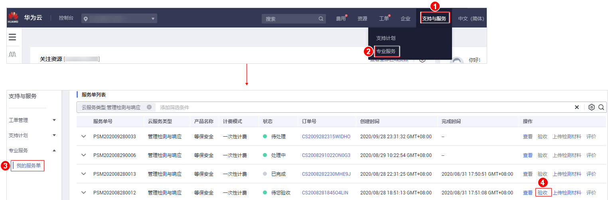

# 下载管理检测与响应报告

## 操作场景

管理检测与响应服务完成后，系统自动生成管理检测与响应服务报告，用户会收到邮件和短信通知信息。用户可在收到通知信息后下载管理检测与响应服务报告。

## 前提条件

管理检测与响应服务完成，且服务单的状态为“待您验收“或“已完成“。

## 操作步骤

1.  [登录管理控制台](https://console.huaweicloud.com/?locale=zh-cn)。
2.  进入下载管理检测与响应服务报告入口，如[图1](#fig1826128113319)所示。

    **图 1**  进入下载管理检测与响应服务报告入口  
    

3.  在“服务单完成信息“区域，单击“下载“获取详细的管理检测与响应服务的服务报告。

    同时也可在“处理日志“区域，单击“下载“查看服务单的过程交付件和管理检测与响应服务报告。

    > **说明：** 
    >等保安全仅支持下载整改解决方案和差距分析报告，测评报告请查看：[如何获取等保测评报告](https://support.huaweicloud.com/mdr_faq/mdr_01_0046.html#section1)。

