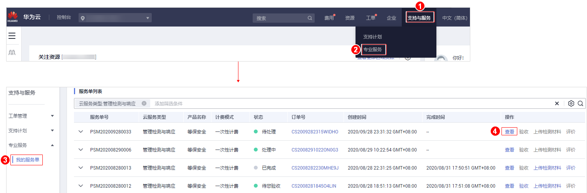

# 查看服务单信息

## 操作场景

该任务指导用户在服务单列表查看服务单基础信息和处理进展。

## 前提条件

用户已购买管理检测与响应并成功生成服务单。

## 操作步骤

1.  [登录管理控制台](https://console.huaweicloud.com/?locale=zh-cn)。
2.  进入查看服务单信息入口，如[图1](#fig324065303113)所示。服务单状态说明如[表1](#table16811172155017)所示。

    **图 1**  进入查看服务单信息入口  
    

    **表 1**  服务单状态参数说明

    
    <table><thead align="left"><tr id="row1081210213509"><th class="cellrowborder" valign="top" width="22.42%" id="mcps1.2.3.1.1">
参数名称

    </th>
    <th class="cellrowborder" valign="top" width="77.58%" id="mcps1.2.3.1.2">
说明

    </th>
    </tr>
    </thead>
    <tbody><tr id="row1581215285019"><td class="cellrowborder" valign="top" width="22.42%" headers="mcps1.2.3.1.1 ">
待处理

    </td>
    <td class="cellrowborder" valign="top" width="77.58%" headers="mcps1.2.3.1.2 ">
用户购买企业版管理检测与响应，服务单付款成功，服务单条状态为“待处理”。

    </td>
    </tr>
    <tr id="row1281272165011"><td class="cellrowborder" valign="top" width="22.42%" headers="mcps1.2.3.1.1 ">
处理中

    </td>
    <td class="cellrowborder" valign="top" width="77.58%" headers="mcps1.2.3.1.2 "><ul id="ul15879121418110"><li>用户购买企业版管理检测与响应，通过沟通联系并审核资质后，服务单状态为“处理中”。</li><li>用户购买等保安全、等保建设助手、等保套餐，服务单付款成功，服务单状态为“处理中”。</li></ul>
    </td>
    </tr>
    <tr id="row581222165016"><td class="cellrowborder" valign="top" width="22.42%" headers="mcps1.2.3.1.1 ">
服务取消

    </td>
    <td class="cellrowborder" valign="top" width="77.58%" headers="mcps1.2.3.1.2 ">
华为云终止本次管理检测与响应，系统将服务单状态更新为“服务取消”。

    </td>
    </tr>
    <tr id="row158121626507"><td class="cellrowborder" valign="top" width="22.42%" headers="mcps1.2.3.1.1 ">
待您验收

    </td>
    <td class="cellrowborder" valign="top" width="77.58%" headers="mcps1.2.3.1.2 ">
管理检测与响应报告由华为安全专家审核通过后，系统将服务单状态更新为“待您验收”。

    </td>
    </tr>
    <tr id="row1081216213507"><td class="cellrowborder" valign="top" width="22.42%" headers="mcps1.2.3.1.1 ">
已完成

    </td>
    <td class="cellrowborder" valign="top" width="77.58%" headers="mcps1.2.3.1.2 ">
管理检测与响应服务完成后，用户对本次管理检测与响应进行验收后，系统将服务单状态更新为“已完成”。

    </td>
    </tr>
    </tbody>
    </table>

    > **说明：** 
    >服务单列表展示了您名下的所有服务单，以上服务单的状态说明为管理检测与响应服务单的状态说明。

3.  详情页面包含以下内容：
    -   基础信息：服务单的产品信息、联系人信息、服务内容等。

        您可以单击，修改联系人电话和邮箱。

    -   服务单完成信息：服务总结、服务报告。

        等保安全的测评报告请查看：[如何获取等保测评报告](https://support.huaweicloud.com/mdr_faq/mdr_01_0046.html#section1)。

    -   服务评价：方案完善度、实施专业性、响应及时性。
    -   处理日志：服务单的历史处理进展。

        对于服务单的过程交付件，您可以单击“下载“来获取。

        > **说明：** 
        >“服务单完成信息“和“服务评价“区域在管理检测与响应完成后，用户进行验收时呈现。

