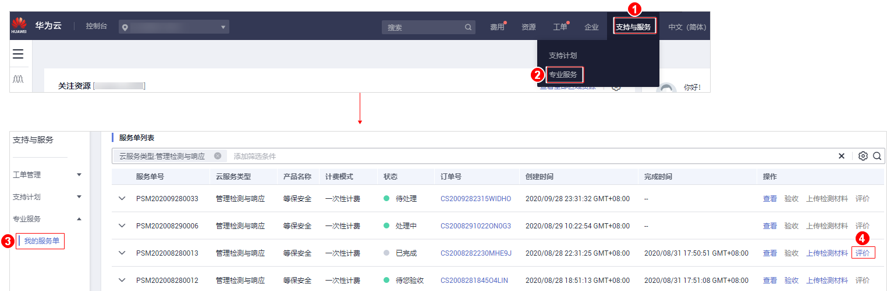

# 评价管理检测与响应

## 操作场景

管理检测与响应完成后，用户会收到短信通知信息。用户可在收到短信通知后，对本次管理检测与响应服务进行评价，并反馈建议或意见。

## 前提条件

-   管理检测与响应完成且服务单状态为“已完成“。
-   已验收管理检测与响应。

## 操作步骤

1.  [登录管理控制台](https://console.huaweicloud.com/?locale=zh-cn)。
2.  进入评价管理检测与响应服务入口，如[图1](#fig92070132343)所示。

    **图 1**  进入评价管理检测与响应服务入口  
    

3.  在“服务评价“区域对本次管理检测与响应服务进行维度评价。

    服务维度包括：方案完善度、实施专业性、响应及时性。

    > **须知：** 
    >用户提交评价意见后，该服务单的服务评价功能失效，用户不能再次提交评价意见。

