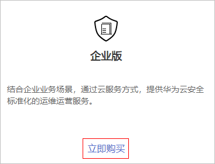
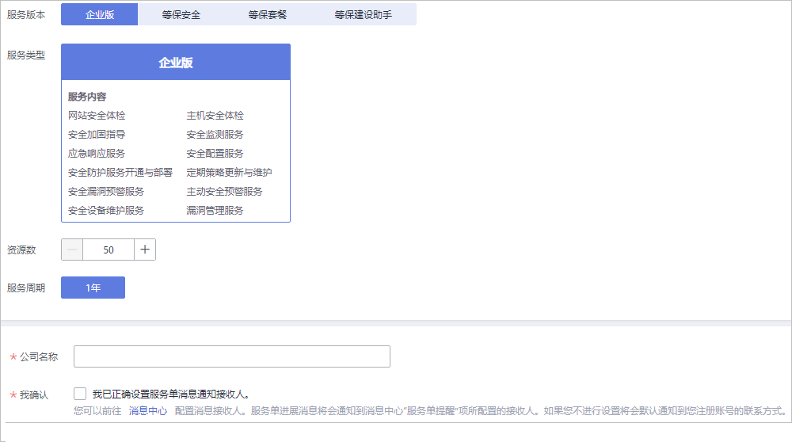

# 购买企业版

企业版管理检测与响应结合企业业务场景，通过云服务方式，提供华为云安全标准化的运维运营服务。 帮助企业与机构实现对安全风险与安全事件的有效监控，并及时采取有效措施持续降低安全风险并消除安全事件带来的损失。

在购买时，用户只需要反馈“资源数“和“公司名称“。购买服务成功后，华为云安全专家团队将快速响应并结合用户业务实际情况，提供华为云安全标准化的运维运营服务。

## 前提条件

> **须知：** 
>购买实例的帐号需具有“SES Administrator“和“BSS Administrator“角色。
>-   BSS Administrator：对帐号中心、费用中心、资源中心中的所有菜单项执行任意操作。项目级策略，在同项目中勾选。

## 操作步骤

1.  [登录管理控制台](https://console.huaweicloud.com/?locale=zh-cn)。
2.  在页面上方选择“区域“后，单击，选择“安全与合规  \>  管理检测与响应服务“。
3.  在“企业版“下方，单击“立即购买“，进入“购买管理检测与响应“界面。

    **图 1**  选择企业版  
    

4.  设置“资源数“、“公司名称“并“勾选我已正确设置服务单消息通知接收人“。

    **资源数**：需要进行检测的服务器数量和网站数量。从购买日起，服务有效期为1年。

    **图 2**  设置信息  
    

5.  在页面右下方，单击“下一步“。
6.  确认订单无误并阅读《管理检测与响应免责声明》和《隐私政策声明》后，勾选“我已阅读并同意《管理检测与响应免责声明》和《隐私政策声明》“，单击“去支付“。
7.  在“支付“页面，请选择付款方式进行付款。
8.  付款成功后，单击“返回管理检测与响应控制台“，返回到“我的服务单“界面。

    购买成功后，华为安全专家将在1个工作日内联系用户，与用户沟通并结合用户业务实际情况，提供华为云安全标准化的运维运营服务。

