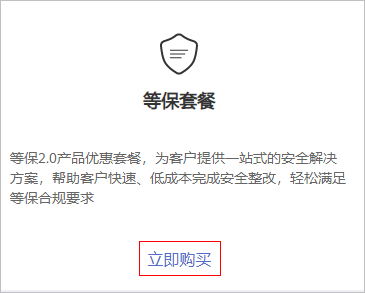

# 购买等保套餐

等保2.0产品优惠套餐为客户提供一站式的安全解决方案，帮助客户快速、低成本完成安全整改，轻松满足等保合规要求。

在购买时，您可以根据业务系统情况选择推荐的等保二级方案、等保三级方案基础版 、等保三级方案高级版以及多云安全方案套餐。在选择服务购买时长时，建议您按年购买。

## 前提条件

> **须知：** 
>购买实例的帐号需具有“SES Administrator“和“BSS Administrator“角色。
>-   BSS Administrator：对帐号中心、费用中心、资源中心中的所有菜单项执行任意操作。项目级策略，在同项目中勾选。

## 立即购买

1.  [登录管理控制台](https://console.huaweicloud.com/?locale=zh-cn)。
2.  在页面上方选择“区域“后，单击，选择“安全与合规  \>  管理检测与响应服务“。
3.  在“等保套餐“下方，单击“立即购买“，进入“购买MDR服务“页面。

    **图 1**  选择等保套餐  
    

4.  选择区域。

    请就近选择靠近您业务的区域，可减少网络时延，提高访问速度 。

5.  选择“等保二级方案“、“等保三级方案基础版“、“等保三级方案高级版“或“多云安全方案套餐“。

    **图 2**  选择套餐  
    

6.  根据选择的套餐，配置套餐商品信息。
    -   配置Web应用防火墙。

        请根据您的业务情况购买“域名扩展包“或“带宽扩展包“以及选择“购买时长“。

        **图 3**  配置Web应用防火墙  
        

    -   配置企业主机安全。

        请根据您的业务情况购买“防护主机数量“和选择“购买时长“。

        **图 4**  配置企业主机安全  
        

    -   配属数据库安全审计。

        请根据您的业务情况选择“可用区“、“规格“、“实例名称“、“虚拟私有云“、“安全组“、“子网“以及选择“购买时长“。

        **图 5**  配置数据库安全审计  
        

    -   配置态势感知。

        请根据您的业务情况设置“最大配额数“和勾选“使用态势大屏“以及选择“购买时长“。

        **图 6**  配置态势感知  
        

    -   配置云堡垒机。

        请根据您的业务情况选择“可用区“、“性能规格“、“实例名称“、“虚拟私有云“、“安全组“、“子网“、“弹性IP“以及选择“购买时长“。

        > **说明：** 
        >若在当前区域无可选EIP，可单击“购买弹性IP“创建弹性IP。

        **图 7**  配置云堡垒机  
        

    -   配置漏洞扫描服务。

        请根据您的业务情况选择“规格“、“扫描配额包“和“购买时长“。

        **图 8**  配置漏洞扫描服务  
        

    -   配置SSL证书。

        请根据您的业务情况选择“域名类型“、“域名数量“和“购买数量“。

        **图 9**  配置SSL证书  
        

    -   配置专属加密服务。

        请根据您的业务情况选择“购买数量“和“购买时长“。

        **图 10**  配置专属加密服务  
        

    -   配置DDoS高防。

        请根据您的业务情况选择“保底防护带宽“、“弹性防护带宽“、“业务带宽“、“购买数量“和“购买时长“。

        **图 11**  配置DDoS高防  
        

    -   配置数据安全中心。

        请根据您的业务情况选择“规格“、“数据库扩展包“、“OBS扩展包“和“购买时长“。

        **图 12**  配置数据安全中心  
        

7.  在页面右下方，单击“下一步“。
8.  确认订单无误并阅读《管理检测与响应免责声明》和《隐私政策声明》后，勾选“我已阅读并同意《管理检测与响应免责声明》和《隐私政策声明》“，单击“去支付“。
9.  在“支付“页面，请选择付款方式进行付款。
10. 付款成功后，单击“返回管理检测与响应控制台“，返回到“管理检测与响应“界面。

## 后续管理

购买成功后，您还需要为购买的产品配置相关参数，才能对主机、网络、应用或数据开启安全防护功能以及开启安全管理功能。

单击页面左上方的，选择“安全“区域下的服务，进入对应服务界面，配置参数，开启安全防护、安全管理功能。

**图 13**  安全服务  

