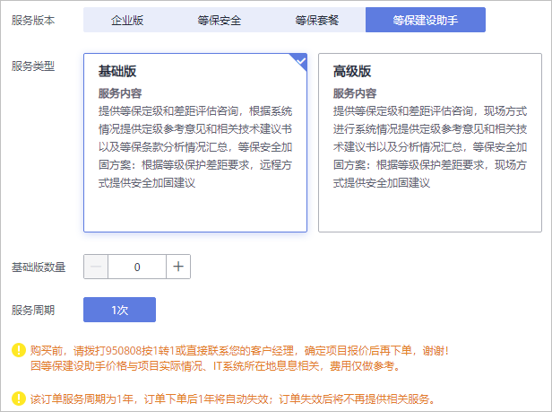
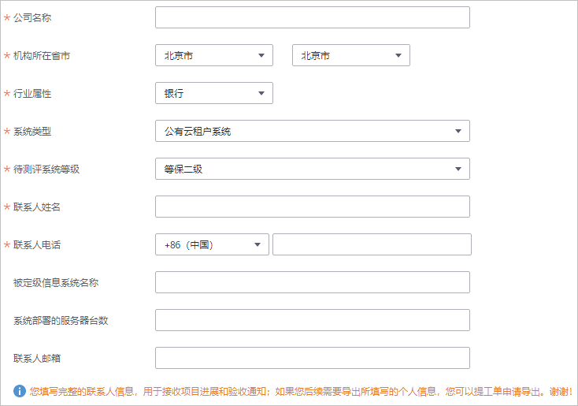

# 购买等保建设助手

等保建设助手为用户提供等保定级和差距评估咨询，根据系统情况提供定级参考意见和相关技术建议书以及等保条款分析情况汇总，根据等保差距要求，服务类型以远程或现场方式提供安全加固建议。

购买时，用户需要反馈基础版、高级版的数量，以及用户信息。在成功购买服务后，华为安全专家团队将根据用户IT系统的实际情况提供定级意见、差距分析以及安全加固建议。

## 购买须知

-   购买实例的账号需具有“SES Administrator“和“BSS Administrator“角色。

    BSS Administrator：对账号中心、费用中心、资源中心中的所有菜单项执行任意操作。项目级策略，在同项目中勾选。

-   等保建设助手价格与项目实际情况、IT系统所在地息息相关，MDR管理控制台上提供的费用仅做参考。
-   购买前，请拨打950808按1转1或直接联系您的客户经理，确定项目报价后再下单。

## 立即购买

1.  [登录管理控制台](https://console.huaweicloud.com/?locale=zh-cn)。
2.  在页面上方选择“区域“后，单击，选择“安全  \>  管理检测与响应服务“。
3.  在“等保建设助手“下方，单击“立即购买“，进入“购买MDR服务“页面。

    **图 1**  选择等保建设助手  
    

4.  选择服务类型“基础版“或“高级版“，并设置购买数量，如[图2](#fig14137103818201)所示。

    **图 2**  购买等保建设助手  
    

5.  设置用户相关信息，如[图3](#mdr_01_0013_zh-cn_topic_0115570354_fig1749620362443)所示，各参数说明如[表1](#mdr_01_0013_table1915312284575)所示。

    **图 3**  设置用户信息  
    

    **表 1**  用户信息参数说明

    
    <table><thead align="left"><tr id="mdr_01_0013_row12160142855710"><th class="cellrowborder" valign="top" width="22.21%" id="mcps1.2.4.1.1">
参数

    </th>
    <th class="cellrowborder" valign="top" width="51.370000000000005%" id="mcps1.2.4.1.2">
说明

    </th>
    <th class="cellrowborder" valign="top" width="26.419999999999998%" id="mcps1.2.4.1.3">
配置样例

    </th>
    </tr>
    </thead>
    <tbody><tr id="mdr_01_0013_row87301857151416"><td class="cellrowborder" valign="top" width="22.21%" headers="mcps1.2.4.1.1 ">
公司名称

    </td>
    <td class="cellrowborder" valign="top" width="51.370000000000005%" headers="mcps1.2.4.1.2 ">
输入公司的名称。

    </td>
    <td class="cellrowborder" valign="top" width="26.419999999999998%" headers="mcps1.2.4.1.3 ">
-

    </td>
    </tr>
    <tr id="mdr_01_0013_row153818311151"><td class="cellrowborder" valign="top" width="22.21%" headers="mcps1.2.4.1.1 ">
机构所在省市

    </td>
    <td class="cellrowborder" valign="top" width="51.370000000000005%" headers="mcps1.2.4.1.2 ">
选择公司所在的省市。

    </td>
    <td class="cellrowborder" valign="top" width="26.419999999999998%" headers="mcps1.2.4.1.3 ">
北京市

    </td>
    </tr>
    <tr id="mdr_01_0013_row66311448171517"><td class="cellrowborder" valign="top" width="22.21%" headers="mcps1.2.4.1.1 ">
行业属性

    </td>
    <td class="cellrowborder" valign="top" width="51.370000000000005%" headers="mcps1.2.4.1.2 ">
选择行业的类型。

    </td>
    <td class="cellrowborder" valign="top" width="26.419999999999998%" headers="mcps1.2.4.1.3 ">
银行

    </td>
    </tr>
    <tr id="mdr_01_0013_row18439204191613"><td class="cellrowborder" valign="top" width="22.21%" headers="mcps1.2.4.1.1 ">
联系人姓名

    </td>
    <td class="cellrowborder" valign="top" width="51.370000000000005%" headers="mcps1.2.4.1.2 ">
输入真实的联系人姓名。

    </td>
    <td class="cellrowborder" valign="top" width="26.419999999999998%" headers="mcps1.2.4.1.3 ">
-

    </td>
    </tr>
    <tr id="mdr_01_0013_row155961137122513"><td class="cellrowborder" valign="top" width="22.21%" headers="mcps1.2.4.1.1 ">
联系人电话

    </td>
    <td class="cellrowborder" valign="top" width="51.370000000000005%" headers="mcps1.2.4.1.2 ">
输入真实的联系人的联系电话。

    </td>
    <td class="cellrowborder" valign="top" width="26.419999999999998%" headers="mcps1.2.4.1.3 ">
-

    </td>
    </tr>
    <tr id="mdr_01_0013_row17882145117427"><td class="cellrowborder" valign="top" width="22.21%" headers="mcps1.2.4.1.1 ">
联系人邮箱

    </td>
    <td class="cellrowborder" valign="top" width="51.370000000000005%" headers="mcps1.2.4.1.2 ">
输入真实的联系人的邮箱。

    </td>
    <td class="cellrowborder" valign="top" width="26.419999999999998%" headers="mcps1.2.4.1.3 ">
-

    </td>
    </tr>
    </tbody>
    </table>

6.  在页面右下方，单击“下一步“。
7.  确认订单无误并阅读《管理检测与响应免责声明》和《隐私政策声明》后，勾选“我已阅读并同意《管理检测与响应免责声明》和《隐私政策声明》“，单击“去支付“。
8.  在“支付“页面，请选择付款方式进行付款。
9.  付款成功后，单击“返回管理检测与响应控制台“，返回到“我的服务单“界面。

    购买成功后，华为安全专家将在1个工作日内联系用户，与用户沟通确定等保需求。

